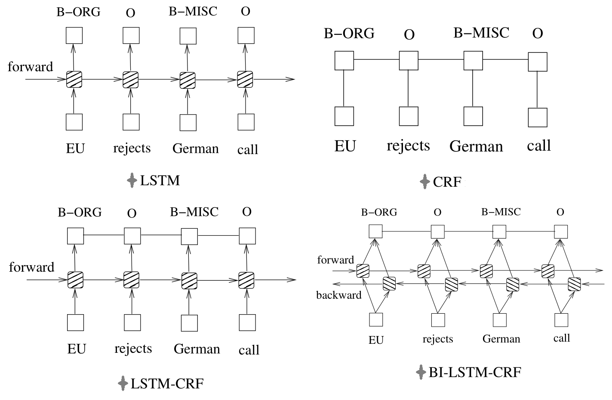
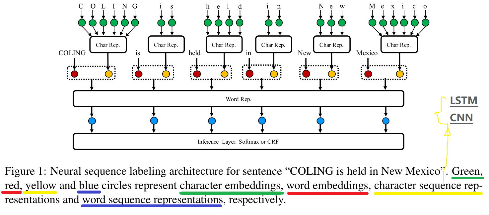
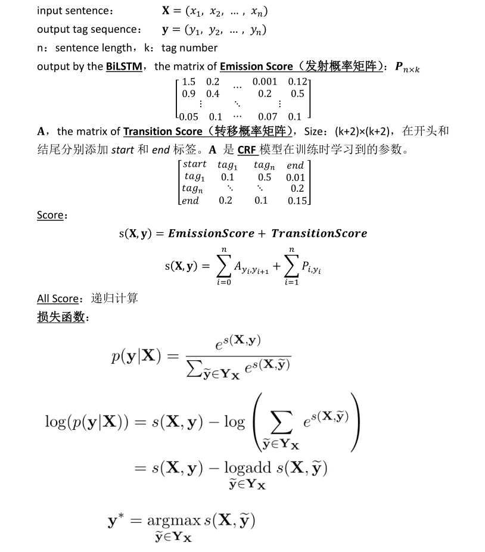

# Sequence Labeling
基于统计方法（CRF/HMM）和神经网络方法的序列标注

## BiLSTM-CRF

### 文献
[Reading-Papers-Neural-Architecture-Sequence-Labeling](./paper)
  - [1] Bidirectional LSTM-CRF models for sequence tagging，2015
  - [2] Neural Architectures for Named Entity Recognition，2016  
  ***文献[2]对应的代码：[NER Tagger](https://github.com/glample/tagger)，基于Theano的实现。代码已经跑通，可以参考。***
  - [3] End-to-end Sequence Labeling via Bi-directional LSTM-CNNs-CRF，2016
  - [4] Design Challenges and Misconceptions in Neural Sequence Labeling，2018  
  序列标注的所有神经网络方法的比较实验。  
    
  (Word-)BiLSTM-CRF又可以按照是否包含char-level信息以及实现方法，分为以下三类。word和char信息通过向量拼接构成新的输入。
    - no Char
    - Char LSTM
    - Char CNN

### 理解模型
通过阅读上面提到的文献，了解了模型的结构，那么如何更深入的理解模型呢？
#### Q1: BiLSTM-CRF为什么比单独BiLSTM、CRF的效果好，两者的作用分别是什么？
参考资料：
- **[最通俗易懂的BiLSTM-CRF模型中的CRF层介绍](https://zhuanlan.zhihu.com/p/44042528)**
- [简明条件随机场CRF介绍](https://zhuanlan.zhihu.com/p/37163081)  

##### 1.1，CRF，需要设计特征工程，结果的优劣与特征的选取有很大关联
##### 1.2，BiLSTM，就像深度学习这个黑盒子那样，可以很好的学习到特征，但是在学习和预测时，无法考虑到语法以及句子中各词之间的相关性，比如I-PER标签不可能跟在B-LOC之后。
##### 1.3，BiLSTM-CRF，结合了各自的优点：BiLSTM可以很好的学习到特征，CRF可以考虑相邻标签之间的关系，计算整个句子的标签的条件概率，自动学习到句子的约束条件
- BiLSTM的输入是词向量，输出是句子中每个单词对应各个标签的分数，即**发射概率矩阵**
- CRF的输入是BiLSTM输出的发射概率矩阵，以及训练模型时需要学习的**转移概率矩阵**，输出是整个句子的每个单词对应的标签
##### 1.Plus：CRF与Softmax的差别
在序列标注任务中，研究的基本单位应该是路径，目标是从k^n（k的n次方）条路径中选出正确的那一条路径。如果将它视为一个分类问题，那么：
- softmax 将序列标注看成是 n 个 k 分类问题，即完全不考虑序列中各词之间的相关性
- CRF 将序列标注看成是 1 个  k^n 分类问题，计算的是条件概率

#### Q2: CRF的理论和公式推导？
**[CRF Layer on the Top of BiLSTM-5 - CreateMoMo Blog](https://createmomo.github.io/2017/11/11/CRF-Layer-on-the-Top-of-BiLSTM-5/)**  
文献[2]也有很好的说明。
- **发射概率矩阵**P，即BiLSTM的输出
- **转移概率矩阵**A，在开头和结尾分别添加start和end标签。转移概率矩阵是CRF的一个参数，在训练模型之前随机初始化，并随着训练的迭代过程被更新，即CRF可以自动学习到这些约束条件
- **损失函数，即CRF计算的条件概率**，即所有可能的标签路径中，真实标签路径的softmax概率值

##### 2.1，如何定义一条标签路径的分值？
见上图
##### 2.2，如何计算所有标签路径的分值之和？
见上图
##### 2.3，模型训练好之后，如何预测？
动态规划，Viterbi算法

#### Q3: 通过PyTorch官网代码教程理解模型
官方教程： [PyTorch-tutorial-BiLSTM-CRF](https://pytorch.org/tutorials/beginner/nlp/advanced_tutorial.html#sphx-glr-beginner-nlp-advanced-tutorial-py)  
已经下载到本地： [tutorial_pytorch_bilstm_crf](./tutorial_pytorch_bilstm_crf/)  
读代码： **[Pytorch BiLSTM + CRF做NER](https://zhuanlan.zhihu.com/p/59845590)**  

## BiLSTM-CRF with PyTorch
### data
